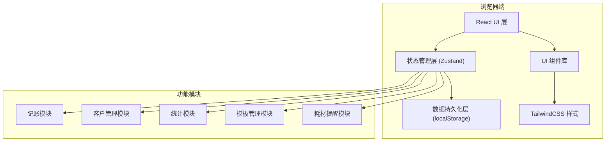
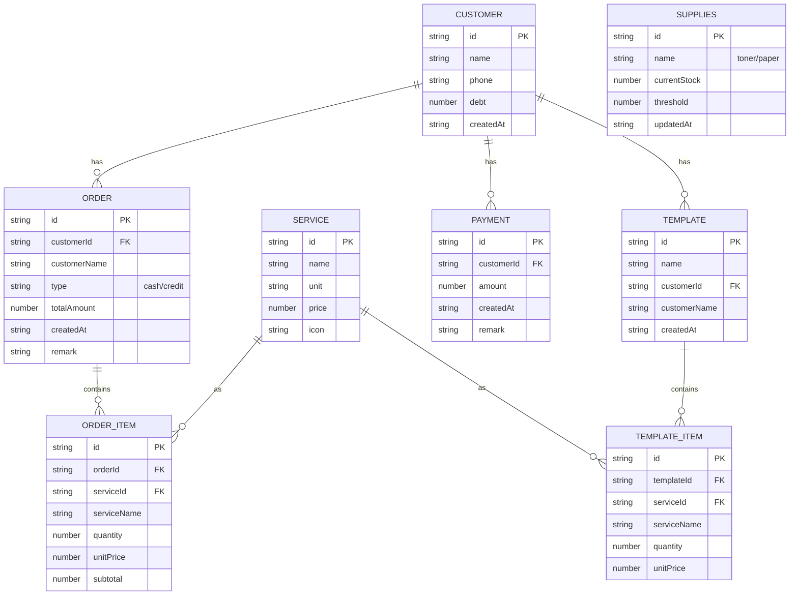

## 1. 架构设计

本工具为纯前端单页应用，无需后端服务，所有数据本地持久化存储。



## 2. 技术描述

- **前端框架**：React@18 + TypeScript
- **构建工具**：Vite@5
- **状态管理**：Zustand@4（轻量级，适合中小型应用）
- **样式方案**：TailwindCSS@3
- **图标库**：Lucide React
- **数据存储**：localStorage（自动持久化）
- **路由方案**：React Router DOM@6
- **日期处理**：date-fns
- **打印方案**：原生 window.print() + 打印专用样式

**选型理由**：
- 纯前端架构，无需部署服务器，店主双击即可使用
- localStorage 足够存储图文店数年的账目数据
- Zustand 比 Redux 更简洁，学习成本低
- TailwindCSS 快速构建美观界面

## 3. 路由定义

| 路由路径 | 页面名称 | 说明 |
|---------|---------|-----|
| `/` | 首页仪表板 | 营收概览、快捷操作、耗材提醒 |
| `/billing` | 记账管理 | 新订单录入、模板调用 |
| `/customers` | 客户管理 | 客户列表、挂账明细、还款登记 |
| `/customers/:id` | 客户详情 | 单个客户的完整交易记录 |
| `/services` | 服务价格 | 服务项目单价配置 |
| `/templates` | 常用模板 | 模板增删改查 |
| `/supplies` | 耗材提醒 | 粉量、纸张库存登记 |

## 4. 数据模型

### 4.1 数据模型定义



### 4.2 初始数据

应用首次运行时自动初始化以下数据：

```typescript
// 初始服务价格
const defaultServices = [
  { id: 'copy', name: '复印', unit: '张', price: 0.5, icon: '📄' },
  { id: 'print', name: '打印', unit: '张', price: 1.0, icon: '🖨️' },
  { id: 'color', name: '彩印', unit: '张', price: 2.0, icon: '🎨' },
  { id: 'scan', name: '扫描', unit: '张', price: 1.0, icon: '📷' },
  { id: 'bind', name: '装订', unit: '本', price: 5.0, icon: '📚' },
];

// 初始耗材配置
const defaultSupplies = [
  { id: 'toner', name: '墨粉', currentStock: 100, threshold: 20, updatedAt: new Date().toISOString() },
  { id: 'paper', name: '纸张', currentStock: 500, threshold: 100, updatedAt: new Date().toISOString() },
];

// 散客（默认客户）
const defaultCustomer = {
  id: 'walk-in',
  name: '散客',
  phone: '',
  debt: 0,
  createdAt: new Date().toISOString(),
};
```

## 5. 状态管理设计

### 5.1 Store 结构

```typescript
// useStore.ts
interface AppState {
  // 数据
  customers: Customer[];
  orders: Order[];
  services: Service[];
  templates: Template[];
  payments: Payment[];
  supplies: Supplies[];
  
  // 客户操作
  addCustomer: (data: Omit<Customer, 'id' | 'debt' | 'createdAt'>) => void;
  updateCustomer: (id: string, data: Partial<Customer>) => void;
  deleteCustomer: (id: string) => void;
  
  // 订单操作
  addOrder: (data: Omit<Order, 'id' | 'createdAt'> & { items: Omit<OrderItem, 'id' | 'orderId'>[] }) => void;
  
  // 服务操作
  updateService: (id: string, price: number) => void;
  
  // 模板操作
  addTemplate: (data: Omit<Template, 'id' | 'createdAt'> & { items: Omit<TemplateItem, 'id' | 'templateId'>[] }) => void;
  deleteTemplate: (id: string) => void;
  
  // 还款操作
  addPayment: (data: Omit<Payment, 'id' | 'createdAt'>) => void;
  
  // 耗材操作
  updateSupplies: (id: string, currentStock: number, threshold?: number) => void;
  
  // 统计方法
  getStats: (period: 'today' | 'week' | 'month') => { total: number; cash: number; credit: number };
  getCustomerDebt: (customerId: string) => number;
}
```

## 6. 目录结构

```
src/
├── components/          # 通用组件
│   ├── Layout.tsx       # 布局组件（导航栏+内容区）
│   ├── StatCard.tsx     # 统计卡片
│   ├── ConfirmModal.tsx # 确认对话框
│   └── PrintLayout.tsx  # 打印布局
├── pages/               # 页面组件
│   ├── Dashboard.tsx    # 首页仪表板
│   ├── Billing.tsx      # 记账管理
│   ├── Customers.tsx    # 客户列表
│   ├── CustomerDetail.tsx # 客户详情
│   ├── Services.tsx     # 服务价格
│   ├── Templates.tsx    # 常用模板
│   └── Supplies.tsx     # 耗材提醒
├── store/               # 状态管理
│   └── useStore.ts
├── types/               # 类型定义
│   └── index.ts
├── utils/               # 工具函数
│   ├── storage.ts       # localStorage 封装
│   ├── date.ts          # 日期处理
│   └── print.ts         # 打印工具
├── App.tsx
├── main.tsx
└── index.css            # 全局样式 + Tailwind
```

## 7. 关键技术点

### 7.1 数据持久化

使用 Zustand 的 persist 中间件，自动将所有状态同步到 localStorage：

```typescript
import { persist } from 'zustand/middleware';

export const useStore = create<AppState>()(
  persist(
    (set, get) => ({ /* ... */ }),
    { name: 'print-shop-storage' }
  )
);
```

### 7.2 统计计算

使用 date-fns 进行日期范围判断，遍历订单数组计算各时间段收入：

```typescript
getStats: (period) => {
  const now = new Date();
  const startOf = {
    today: startOfDay(now),
    week: startOfWeek(now, { weekStartsOn: 1 }),
    month: startOfMonth(now),
  }[period];
  
  return get().orders
    .filter(o => new Date(o.createdAt) >= startOf)
    .reduce((acc, o) => ({
      total: acc.total + o.totalAmount,
      cash: acc.cash + (o.type === 'cash' ? o.totalAmount : 0),
      credit: acc.credit + (o.type === 'credit' ? o.totalAmount : 0),
    }), { total: 0, cash: 0, credit: 0 });
}
```

### 7.3 打印功能

对账单打印使用 CSS 媒体查询，隐藏非必要元素：

```css
@media print {
  @page {
    size: A4;
    margin: 2cm;
  }
  .no-print {
    display: none !important;
  }
  .print-only {
    display: block !important;
  }
}
```
